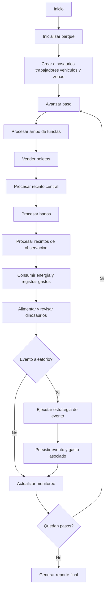

# Flujo de simulacion

```mermaid
flowchart TD
    A[Inicio] --> B[Inicializar parque]
    B --> C[Crear dinosaurios trabajadores vehiculos y zonas]
    C --> D[Avanzar paso]
    D --> E[Procesar arribo de turistas]
    E --> F[Vender boletos]
    F --> G[Procesar recinto central]
    G --> H[Procesar banos]
    H --> I[Procesar recintos de observacion]
    I --> J[Consumir energia y registrar gastos]
    J --> K[Alimentar y revisar dinosaurios]
    K --> L{Evento aleatorio?}
    L -->|Si| M[Ejecutar estrategia de evento]
    L -->|No| N[Actualizar monitoreo]
    M --> O[Persistir evento y gasto asociado]
    O --> N
    N --> P{Quedan pasos?}
    P -->|Si| D
    P -->|No| Q[Generar reporte final]
```
