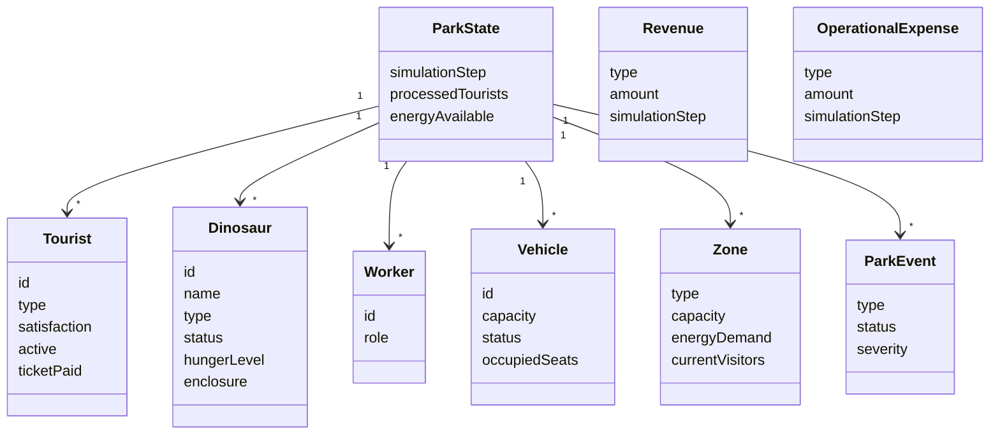

# Modelo de entidades

```mermaid
classDiagram
    class Tourist {
        id
        type
        satisfaction
        active
        ticketPaid
    }
    class Dinosaur {
        id
        name
        type
        status
        hungerLevel
        enclosure
    }
    class Worker {
        id
        role
    }
    class Vehicle {
        id
        capacity
        status
        occupiedSeats
    }
    class Zone {
        type
        capacity
        energyDemand
        currentVisitors
    }
    class ParkState {
        simulationStep
        processedTourists
        energyAvailable
    }
    class Revenue {
        type
        amount
        simulationStep
    }
    class OperationalExpense {
        type
        amount
        simulationStep
    }
    class ParkEvent {
        type
        status
        severity
    }
    ParkState "1" --> "*" Tourist
    ParkState "1" --> "*" Dinosaur
    ParkState "1" --> "*" Worker
    ParkState "1" --> "*" Vehicle
    ParkState "1" --> "*" Zone
    ParkState "1" --> "*" ParkEvent
```
