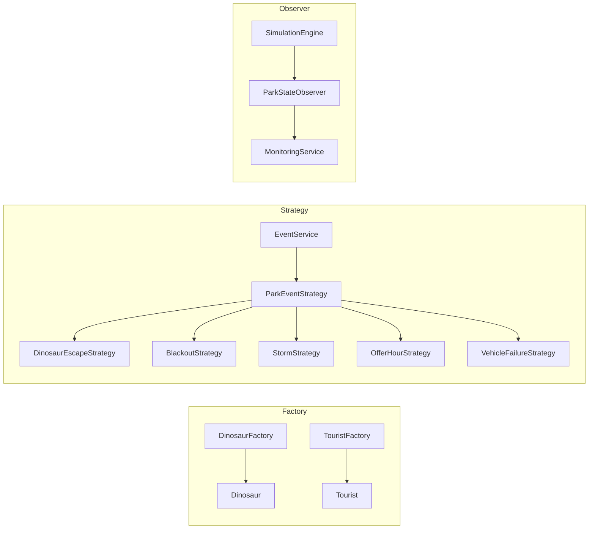

# Patrones de diseno

## Justificacion

- Factory evita duplicar reglas de creacion de turistas y dinosaurios.
- Strategy permite agregar nuevos eventos sin modificar el motor de simulacion.
- Observer desacopla el monitoreo del procesamiento de pasos.
