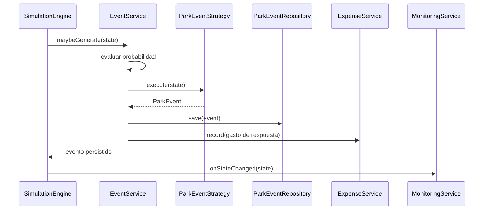

# Secuencia de eventos

```mermaid
sequenceDiagram
    participant Engine as SimulationEngine
    participant EventService as EventService
    participant Strategy as ParkEventStrategy
    participant EventRepo as ParkEventRepository
    participant ExpenseService as ExpenseService
    participant Monitor as MonitoringService

    Engine->>EventService: maybeGenerate(state)
    EventService->>EventService: evaluar probabilidad
    EventService->>Strategy: execute(state)
    Strategy-->>EventService: ParkEvent
    EventService->>EventRepo: save(event)
    EventService->>ExpenseService: record(gasto de respuesta)
    EventService-->>Engine: evento persistido
    Engine->>Monitor: onStateChanged(state)
```
